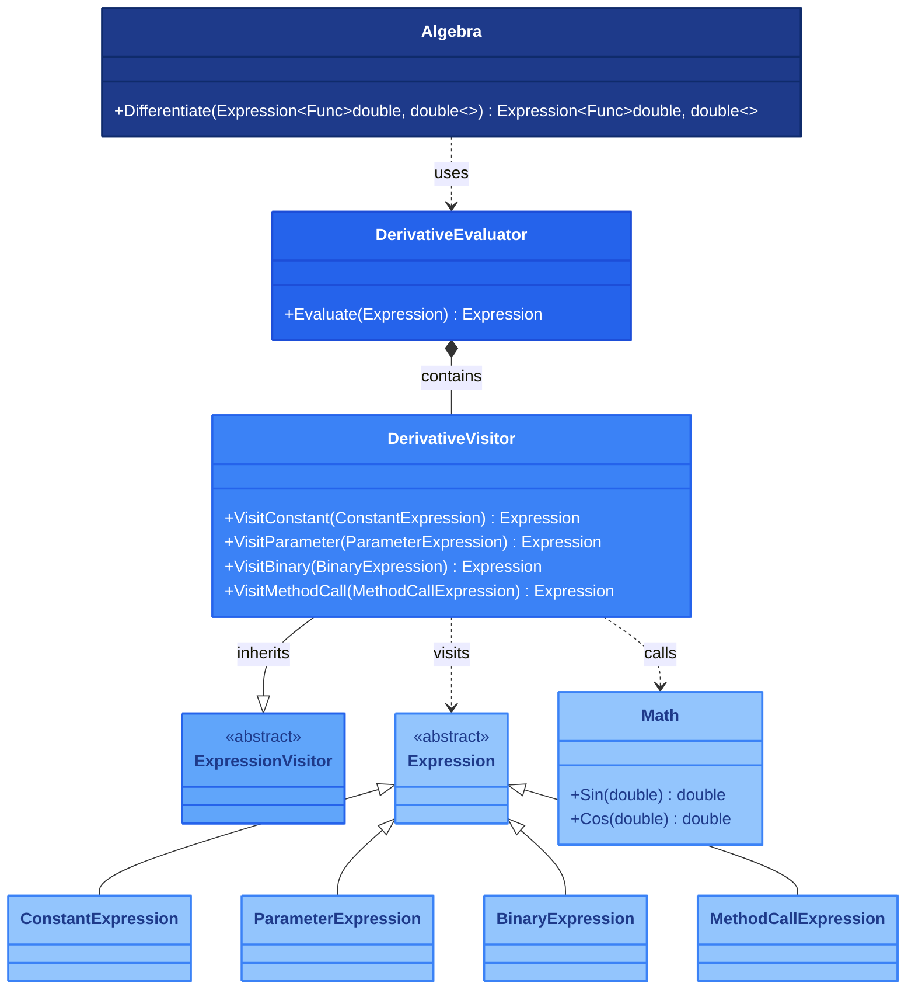

## 1. Описание предметной области и сущностей

Система выполняет символьное дифференцирование выражений (сложение, умножение, синус, косинус) через LINQ-деревья, принимая функцию одной переменной double.
Ядро — класс Algebra с методом Differentiate, использующий ExpressionVisitor и посетитель DerivativeVisitor для обхода и обработки каждого узла.
Константы и параметры дают производные 0 и 1, для сложения и умножения применяются суммы производных и правило произведения соответственно.
Для синуса и косинуса вычисляются цепные правила, а при неподдерживаемых операциях выбрасывается исключение.
Архитектура легко расширяется добавлением новых функций и операторов через доработку посетителя.

## 2. Диаграмма классов

