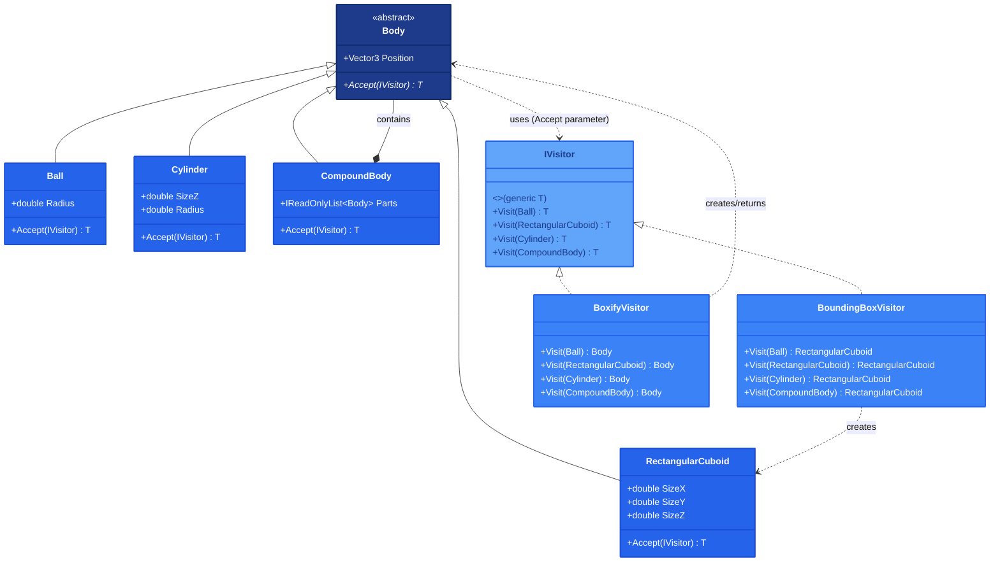

## 1. Описание предметной области и сущностей

В системе трёхмерные тела (шар, параллелепипед, цилиндр, составное) обрабатываются через паттерн Visitor: каждый посетитель реализует обобщённый интерфейс, а тела принимают его через метод Accept. Конкретные посетители вычисляют ограничивающий параллелепипед или заменяют тела на него, рекурсивно обрабатывая составные объекты. Паттерн гарантирует обработку всех типов на этапе компиляции и позволяет легко добавлять новые операции без изменения существующих классов.

## 2. Диаграмма классов

