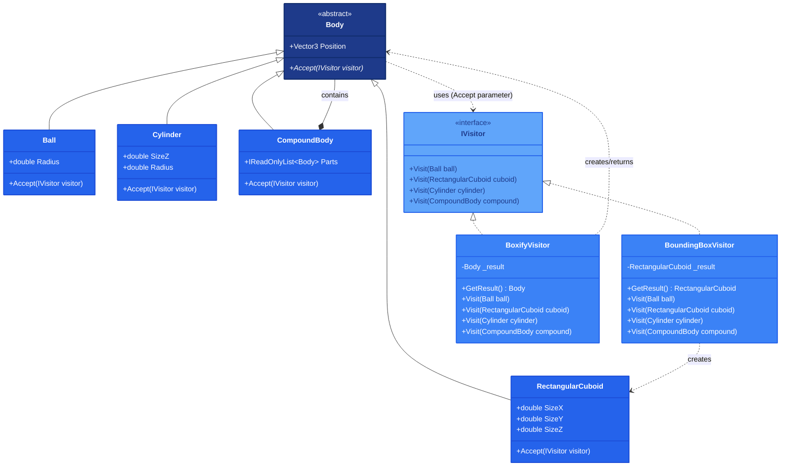

## 1. Описание предметной области и сущностей

В системе реализован классический паттерн Visitor для работы с трёхмерными геометрическими телами (шар, параллелепипед, цилиндр, составное тело). Каждое тело определяет метод Accept, принимающий посетителя (IVisitor) и передающий управление соответствующему методу Visit. Посетители не хранят ссылок на тела, а только обрабатывают их как параметры. Конкретные посетители: BoundingBoxVisitor вычисляет минимальный ограничивающий параллелепипед, сохраняя результат в своём поле; BoxifyVisitor заменяет все простые тела на их параллелепипеды, рекурсивно обрабатывая составные объекты. Такой подход гарантирует обработку всех типов на этапе компиляции, исключает условные операторы и позволяет легко добавлять новые операции без изменения классов тел.

## 2. Диаграмма классов

