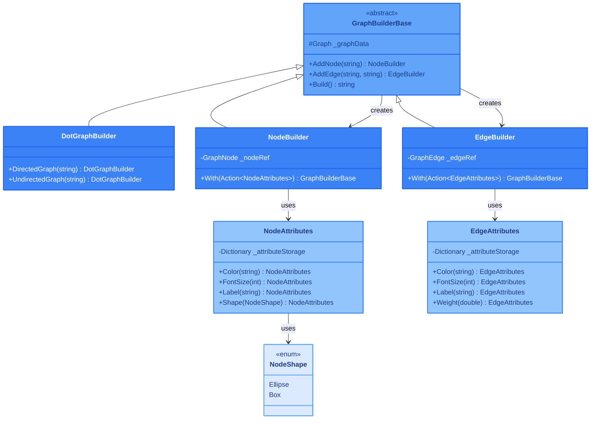

## 1. Описание предметной области и сущностей

Система предоставляет Fluent API для построения описания графов в формате DOT, используемом инструментом GraphViz.  
Базовый класс `GraphBuilderBase` управляет графом и предоставляет методы `AddNode` и `AddEdge` для добавления элементов.  
`DotGraphBuilder` (наследник) создаёт направленный или ненаправленный граф через статические методы `DirectedGraph` и `UndirectedGraph`.  
`NodeBuilder` и `EdgeBuilder`, также наследующие `GraphBuilderBase`, позволяют настраивать атрибуты узлов и рёбер через метод `With`, принимающий делегат для установки свойств.  
Атрибуты (цвет, размер шрифта, метка, форма для узлов; вес для рёбер) задаются через классы `NodeAttributes` и `EdgeAttributes`.  
Fluent API гарантирует, что в каждом контексте доступны только соответствующие атрибуты, предотвращая ошибки, и архитектура легко расширяется новыми атрибутами без изменения основного API.

## 2. Диаграмма классов

