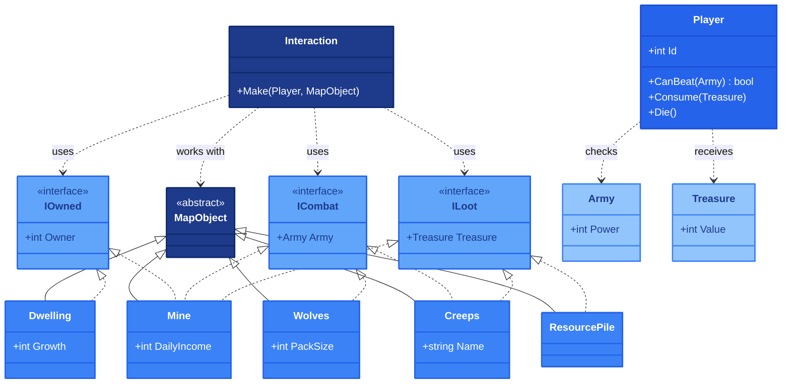

## 1. Описание предметной области и сущностей

В игровой среде объекты могут иметь владельца, вступать в бой или содержать ресурсы; игрок (Player) оценивает силы, получает награду и может погибнуть.
Объект карты (MapObject) — абстрактный базовый класс, а система взаимодействий (Interaction) управляет контактом через метод Make.
Для владения, боя и награды определены интерфейсы IOwned, ICombat и ILoot.
Interaction использует эти интерфейсы, не привязываясь к конкретным классам объектов.
При проверке боя Player обращается к Army, а при получении награды — к Treasure.

## 2. Диаграмма классов

