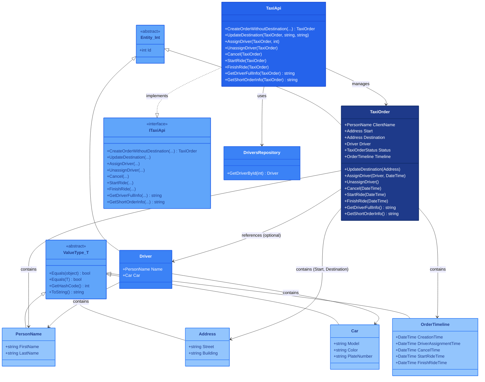

## 1. Описание предметной области и сущностей

Система управляет заказами такси (создание, назначение водителя, статусы, хронология), центральным агрегатом является `TaxiOrder`, содержащий клиента, адреса, водителя, статус и временную шкалу.  
Для имени и адресов используются Value-объекты (`PersonName`, `Address`), водитель (`Driver`) — Entity с именем и автомобилем (`Car`).  
`Car` и `OrderTimeline` (хранит времена ключевых событий) также являются Value-типами, наследуемыми от `ValueType<T>`, который автоматически реализует сравнение по свойствам.  
`TaxiOrder` наследует от `Entity<int>` и инкапсулирует бизнес-логику (`AssignDriver`, `Cancel`, `StartRide`, `FinishRide`) с проверкой допустимости действий по статусу.  
`TaxiApi` — фасад, делегирующий вызовы методам заказа, а `DriversRepository` занимается только получением водителей по ID.  
Архитектура следует DDD: богатая доменная модель, инкапсуляция, Value-объекты и репозитории.

## 2. Диаграмма классов

